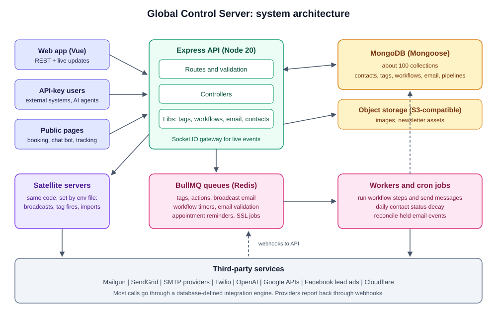
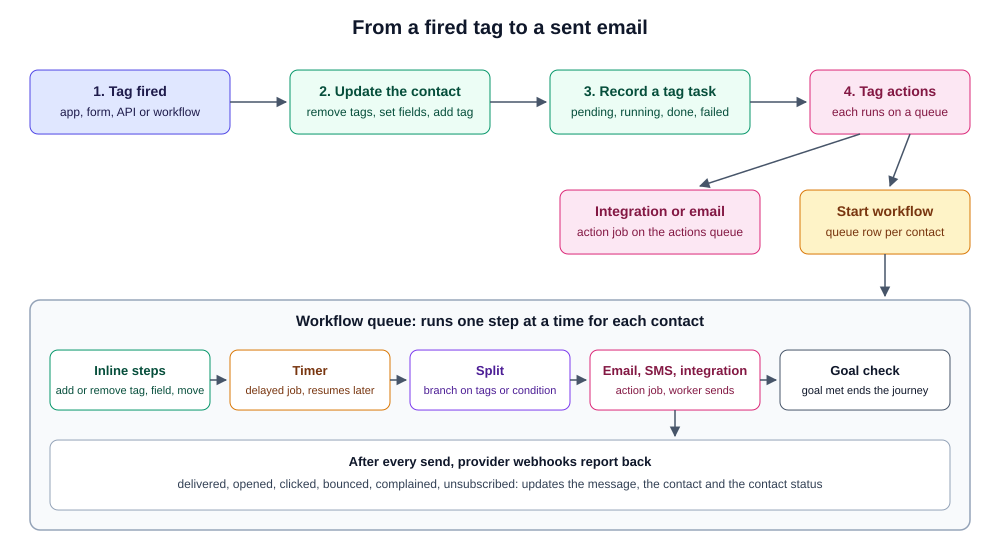
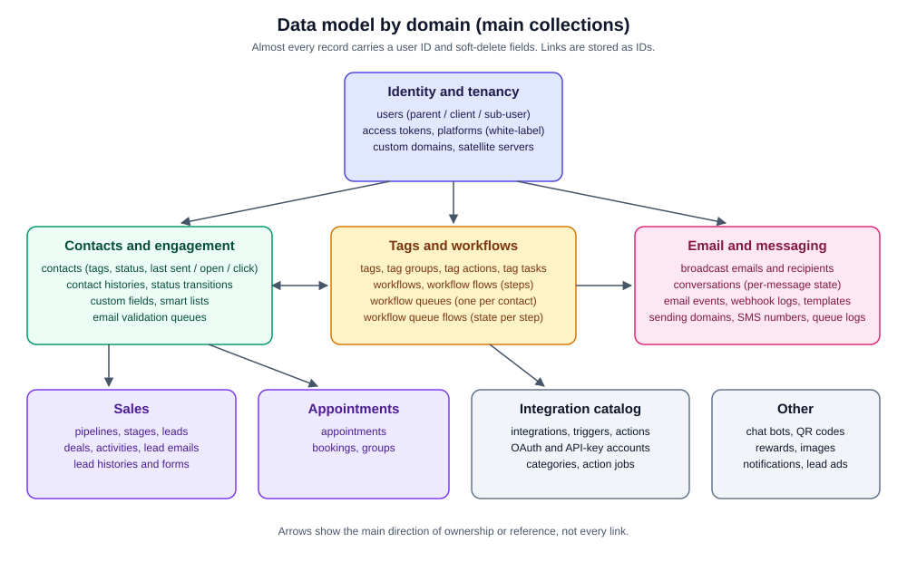

# Global Control Server

Documentation for the backend API behind Global Control, a CRM and marketing automation platform for agencies and their clients. The web app that talks to this API is documented in [Global-Control-Frontend](https://github.com/jsoftsol/Global-Control-Frontend), and the admin panel that manages it in [Global-Control-Admin](https://github.com/jsoftsol/Global-Control-Admin).

> **The source code is not included in this repository.** This is client work and the code is proprietary. This repo only holds documentation: this README, a reverse-engineered product spec ([PRD.md](PRD.md)), and three diagrams in `screenshots/`. Everything here was written from a read-through of the actual codebase. Hostnames, credentials, endpoint details and security specifics are left out on purpose.

## What it does

The server stores contacts, runs the automation around them, and sends the email and SMS. A contact gets tagged. A tag can start a workflow, which is a chain of steps such as send an email, wait, branch on a condition, add or remove tags, move the contact to another workflow, or call a third-party service. The server also runs broadcast email, sales pipelines, appointment booking, AI chat bots, engagement reporting, and the account structure agencies need to manage clients under their own brand.

## Architecture



```
Frontend / external API users
        |
   Express API  --- Socket.IO (live events to the web app)
        |
   Controllers -> Libs (business logic) -> Mongoose models -> MongoDB
        |
   BullMQ queues (Redis) -> workers -> email, SMS, integrations
        |
   Satellite servers (same codebase) for heavy jobs
```

- **API layer.** Express 4 with about 88 route files and about 700 route definitions. Controllers handle HTTP, and most logic lives in static-method classes under `Libs/`.
- **Queues.** BullMQ on Redis runs tag firing, workflow timers, broadcast sends, action jobs, email validation and appointment reminders. A few node-cron jobs handle appointment notifications, contact status decay and reconciling email webhook events.
- **Satellite servers.** The same codebase is deployed a second time as a separate server and switched into satellite mode through its environment file. A satellite runs the queue work (broadcasts, tag fires, imports, workflow processing), and the main server sends it jobs over HTTP. A satellite serves its own dedicated set of job routes (about 20 endpoints for broadcasts, tag and action fires, contact imports, queue processing and similar work) instead of the full product API. This keeps the main API responsive. There is no separate repository or fork: the two deployments differ by configuration only.
- **Realtime.** Socket.IO pushes queue activity, tag task state, notifications and lead events to the web app.
- **Integration engine.** Third-party services are described in the database as integrations, triggers and actions, with request definitions that the server executes in a sandbox. Adding a new service does not need a code change for most cases.
- **Multi-tenancy.** Accounts are separated by user ID. Agencies own client accounts, and white-label platforms and custom domains let clients see the product under the agency's brand.
- **Storage.** MongoDB for application data, Redis for queues, S3-compatible object storage for images and newsletter assets.

### How a tag runs a workflow



## Tech stack

| Area | Tools |
|---|---|
| Runtime | Node.js 20, plain JavaScript (ES modules) |
| Framework | Express 4 |
| Database | MongoDB with Mongoose 6 |
| Queues | BullMQ on Redis, node-cron |
| Realtime | Socket.IO 4 with JWT handshake |
| Auth | JSON Web Tokens with server-side session records, per-user API tokens |
| Email and SMS | Mailgun, SendGrid, custom SMTP, Twilio |
| AI | OpenAI Assistants API |
| Other services | Google APIs, Facebook lead ads, Cloudflare, S3 and Wasabi storage |
| Operations | pm2, nginx and certbot for custom-domain SSL |

## Core features

- **Contacts.** Create, import, search, filter and export. Each contact has tags, custom fields, an event history and an engagement status.
- **Contact status.** One shared classification puts every contact in one of six states: new, active, inactive, passive, dead or undeliverable. It is based on when email was last sent, opened or clicked, and a daily job records status changes as time windows pass.
- **Tags and actions.** Tags carry actions (call an integration, add or remove other tags, start a workflow) and task records that show pending, running, failed and completed state.
- **Workflows.** Step types are send email, send SMS, timer, split by condition, add or remove tag, set custom field, move to another workflow, and fire an integration. Per-contact queues track progress, freezing, goal tracking and unsubscribes.
- **Broadcast email and newsletters.** Recipient selection by status, tag or smart list, one job per recipient, tracking links, unsubscribe handling, and reports.
- **Email event handling.** Delivery, open, click, bounce, complaint and unsubscribe events from Mailgun and SMTP providers update the contact and the message record. Events that arrive before their message is recorded are held and matched later.
- **Pipelines and deals.** Stages, leads, deals, activities, history, and Gmail threading for lead email.
- **Appointments.** Availability rules, public booking, cancel and reschedule, and reminder emails.
- **AI chat bots.** Bot settings, assistant and file management, and public chat endpoints.
- **Integration catalog.** Categories, integrations, accounts, OAuth and API-key connections, testing tools.
- **Agency tools.** Client and sub-user accounts, white-label platforms, custom domains with SSL issuance.
- **Libraries.** Images, QR codes, rewards and reward fulfillment.
- **AI-agent API.** A second API surface of about 117 routes, secured by an API key, that mirrors most of the product for automation by AI agents.

## Data model



About 100 MongoDB collections, grouped by domain. Almost every record carries a `userId` and soft-delete fields. References are mostly stored as string IDs.

- **Identity and tenancy:** users, sub-users, access tokens, platforms (white-label brands), custom domains and SSL records, satellite servers, admins.
- **Contacts and engagement:** contacts, contact histories, contact status transitions, custom fields, smart lists, email validation queues.
- **Tags and workflows:** tags, tag groups and labels, tag actions, tag tasks, workflows, workflow flows (the steps), workflow queues (one per contact in a workflow), workflow queue flows (state per step).
- **Email and messaging:** broadcast emails and their per-contact records, conversations (per-message delivery and engagement state), transactional emails, email templates, email events, webhook logs, sending domains, SMS numbers, queue logs.
- **Sales:** pipelines, stages, leads, deals, lead activities, lead emails and histories.
- **Appointments:** appointments, bookings, groups.
- **Integrations:** integrations, triggers, actions, OAuth and API-key records, categories.
- **Other:** chat bots, QR codes, rewards, images, notifications, lead ads, learning progress.

## Known limitations

An honest list from the read-through:

- **Security needs an audit.** Secrets handling, request authentication coverage, input validation, rate limiting and webhook verification all need a proper review before the platform grows further. The details are not published here.
- **No automated tests.** There is no test suite, no linting and no CI pipeline. The `test` folder holds one-off scripts and data fixes.
- **Aging dependencies.** Mongoose 6, AWS SDK v2, an old JWT library, and a sandbox package that is no longer maintained. Several installed packages are unused.
- **Dead and duplicate code.** A large backup folder, old models and controllers, empty route files and a lot of commented-out code are tracked in git.
- **Unfinished features.** Re-engagement campaigns exist as a model with no routes. Zoom, Outlook calendar and PayPal exist as configuration fields but no live code. The old MySQL layer is unused.
- **Logic repeated in places.** The contact status rule is implemented in several spots, and some have drifted from the shared version.
- **Several very large files.** The biggest controllers and libraries run past 1,500 lines, with one near 3,600.
- **Responses are always HTTP 200.** Errors are signalled in the response body, which makes monitoring and client handling harder.
- **Logging is console output only.** There is no structured logging or error tracking service.
- **Manual deployment.** pm2 reload on the server, with no container image or automated release.

## Author

Ammad Sarfraz

This repository contains documentation only. The Global Control platform and its source code belong to the client.
